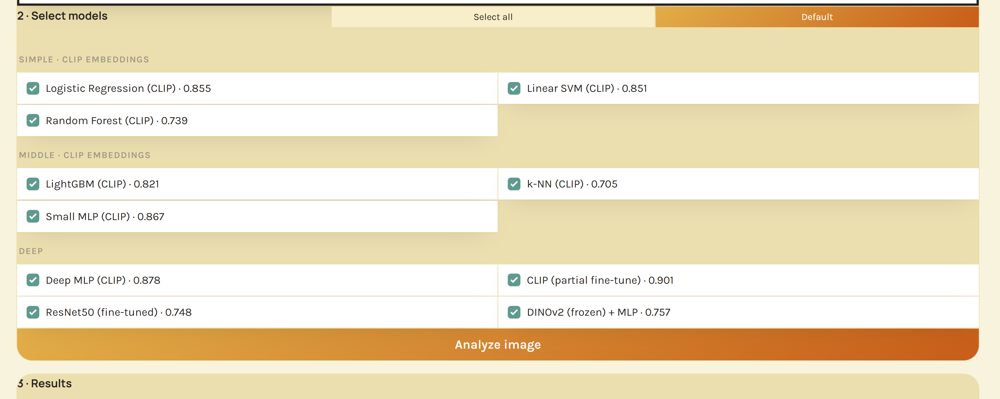

# AI-Generated Image Detection

A 10-model comparison for distinguishing AI-generated images from real photos, all trained and evaluated on identical **open-set** splits — training on legacy/mid-generation generators and testing on modern generators (SDXL, SD3, DALL-E 3) the models never saw during training, to measure real generalization rather than in-distribution accuracy alone.

Companion project to [ai-video-detection](https://github.com/fawad-shahidi/ai-video-detection) (0.995 AUC), same frozen-encoder + cached-embeddings approach applied to still images, extended here into a full model comparison with a model-registry-driven web app (same pattern as a separate Pashto fake-news detection project of mine: pick a model from a registry, run it, compare results).

## Overview

- **Task:** binary classification — is this photo real or AI-generated?
- **Data:** ~131,000 images from [Tiny-GenImage](https://huggingface.co/datasets/TheKernel01/Tiny-GenImage) (7 legacy/mid generators: ADM, BigGAN, GLIDE, SD1.5, VQDM, Wukong, Midjourney) and [Defactify/MS-COCOAI](https://huggingface.co/datasets/Rajarshi-Roy-research/Defactify_Image_Dataset) (5 modern generators: SD2.1, SDXL, SD3, DALL-E 3, Midjourney v6).
- **Evaluation:** open-set — train generators and held-out OOD generators are disjoint by construction, with near-duplicate images grouped and kept on the same side of every split (never split across train/test).
- **Architecture:** frozen CLIP ViT-B/32 (and DINOv2-base) embeddings feeding lightweight classifier heads, plus two partially fine-tuned deep models, spanning three complexity tiers.
- **Result:** a real, visible generalization gap between in-distribution and open-set accuracy across every model, and a fine-tuned CLIP encoder outperforming every frozen-embedding approach.

## Web UI



Ten models grouped by tier (Simple / Middle / Deep), each showing its OOD aggregate AUC inline. Selecting multiple models and clicking **Analyze image** returns a per-model verdict plus a majority-vote banner — see the Results section above for the numbers behind each model's checkbox label.

## Results

10 models across three complexity tiers, all evaluated on the same train/val/OOD/Midjourney splits. Full table: [`data/model_comparison.md`](data/model_comparison.md) (regenerate with `python src/compare_models.py`).

| Model | Tier | ID val AUC | OOD aggregate AUC | DALL-E 3 AUC |
|---|---|---|---|---|
| CLIP (partial fine-tune) | Deep | 0.990 | **0.901** | **0.837** |
| Deep MLP (CLIP) | Deep | 0.978 | 0.878 | 0.822 |
| Small MLP (CLIP) | Middle | 0.978 | 0.867 | 0.797 |
| Logistic Regression (CLIP) | Simple | 0.942 | 0.855 | 0.792 |
| Linear SVM (CLIP) | Simple | 0.942 | 0.851 | 0.785 |
| LightGBM (CLIP) | Middle | 0.920 | 0.821 | 0.764 |
| DINOv2 (frozen) + MLP | Deep | 0.953 | 0.757 | 0.676 |
| ResNet50 (fine-tuned) | Deep | 0.969 | 0.748 | 0.536 |
| Random Forest (CLIP) | Simple | 0.868 | 0.739 | 0.702 |
| k-NN (CLIP) | Middle | 0.838 | 0.705 | 0.712 |

**Key findings:**
- **Fine-tuning the encoder beats every frozen-embedding approach.** CLIP partial fine-tune (last 2 of 12 vision layers unfrozen) is the best model on every metric, by the widest margin on the hardest split (DALL-E 3).
- **Non-linear heads beat linear ones on the same CLIP embeddings**, and depth adds a further small gain (Deep MLP > Small MLP > Logistic Regression/Linear SVM at both ID and OOD).
- **CLIP is a better backbone than DINOv2 for this task, holding the head architecture fixed.** DINOv2 (frozen) + MLP uses the identical head shape as Small MLP (CLIP) — 0.953/0.757 vs 0.978/0.867 isolates the backbone as the cause, not the head.
- **ResNet50 fine-tuned on ImageNet-derived features generalizes worst to DALL-E 3** (0.536, barely above chance) despite a respectable ID score (0.969) — the largest ID/OOD gap of any model here, and the clearest single sign that ImageNet-pretrained features transfer unevenly across generator families compared to CLIP's web-scale pretraining.
- Tree/instance-based models on raw CLIP embeddings (Random Forest, k-NN) underperform every other approach — CLIP's embedding space rewards a learned decision boundary (linear or MLP) over local/split-based methods.
- **DALL-E 3 is the hardest case for every model.** It's architecturally the furthest from the training generators (a fully different commercial pipeline vs. the Stability-lineage SD-family training data), and it shows: even the best model drops from 0.990 ID to 0.837 on it.

## Architecture

Every model shares the same frozen-encoder-plus-head philosophy that worked well in the companion video-detection project, extended across a wider range of heads and two partially fine-tuned encoders:

- **Simple** (Logistic Regression, Linear SVM, Random Forest) and **Middle** (LightGBM, k-NN, Small MLP) tiers: classical ML / lightweight heads trained on cached, frozen CLIP ViT-B/32 embeddings (512-dim, one embedding per image, no backprop through the encoder).
- **Deep** tier:
  - **Deep MLP (CLIP):** a deeper head (5 hidden layers) on the same frozen CLIP embeddings.
  - **CLIP (partial fine-tune):** `CLIPVisionModelWithProjection` (vision tower + projection only — the unused text encoder is never loaded) with the last 2 of 12 transformer layers unfrozen, plus a linear head, trained end-to-end on images directly.
  - **ResNet50 (fine-tuned):** ImageNet-pretrained ResNet50 with `layer3`/`layer4` unfrozen, plus a linear head.
  - **DINOv2 (frozen) + MLP:** frozen DINOv2-base embeddings (768-dim, CLS token) feeding the exact same head architecture as Small MLP (CLIP), isolating backbone choice from head choice.

All 10 share one data-loading/masking/evaluation core ([`src/common_eval.py`](src/common_eval.py)) so no training script reimplements split handling, and all report against the identical open-set splits.

## Open-set design

- **Train / ID generators** (Tiny-GenImage): ADM, BigGAN, GLIDE, SD1.5, VQDM, Wukong. (SD1.4 is listed in the source dataset's schema but has zero rows in the actual data.)
- **Held-out OOD generators** (Defactify/MS-COCOAI): SD2.1, SDXL, SD3, DALL-E 3 — architecturally distinct enough from the SD1.x-family training generators (SDXL/SD3 are different-generation Stability architectures; DALL-E 3 is a fully separate commercial pipeline) to count as genuinely unseen.
- **Midjourney** appears in both source datasets (an early vintage in Tiny-GenImage, v6 in Defactify) and is routed to a separate reporting-only bucket, excluded from both train and the headline OOD metric, since it would otherwise leak across the open-set boundary.
- **Near-duplicate images** are grouped via perceptual hashing across both sources combined (not per-source), and every image in a group lands on the same side of every split — a near-duplicate pair is never split across train and test.

## Documented caveats

- **Metadata confound gate:** a first pass training a classifier on raw file metadata alone (no pixel content) scored AUC 1.0 on Tiny-GenImage — every fake image happened to be PNG and every real image JPEG, a trivial artifact of how the source dataset was exported, not a real detection signal. A standardization step (uniform resize + re-encode) was added specifically to kill this; after standardization the aggregate/source-level metadata checks drop to 0.55–0.64 (near chance) and pass a hard gate before any content-based model is trusted. See [`src/confound_baseline.py`](src/confound_baseline.py).
- **Residual per-generator file-size signal, reported but not gated:** even after standardization, a handful of generators (GLIDE 0.87, BigGAN 0.79, ADM 0.67, Midjourney-legacy 0.70, DALL-E 3 0.65 AUC from post-compression file size alone) remain partly separable from file size. This reflects genuine content-complexity differences between generators (GLIDE and BigGAN are documented to produce blurrier, lower-fidelity output than other generators) rather than a pipeline artifact — a real content-based detector would pick up the same underlying complexity difference through richer features regardless, so gating on it would mean rejecting real generator diversity for a crude single-feature proxy. Reported as a caveat, not blocked.
- **DALL-E 3 is the hardest OOD case for every model** (see Results above) — the clearest sign that generalization to a genuinely different generator family is harder than generalization within a family (e.g. SD1.x → SDXL/SD3).
- **No hyperparameter search** beyond k-NN's k sweep — every model uses one reasonable configuration rather than a tuned one, so relative rankings are informative but none of these numbers should be read as each model's ceiling.
- **Uncalibrated 0.5 decision threshold**, tuned implicitly by training-set balance rather than calibrated per model or per track — a deployment targeting modern-generator content specifically should recalibrate against an OOD-like validation set.

## Setup

```
git clone https://github.com/fawad-shahidi/ai-image-detection.git
cd ai-image-detection
pip install -r requirements.txt
# torch/torchvision/torchaudio: install a CUDA build matching your GPU, e.g.
pip install torch torchvision torchaudio --index-url https://download.pytorch.org/whl/cu130
```

Requires Python 3.12. A 4GB VRAM GPU is sufficient for every model here, including both fine-tuning runs (vision-tower-only CLIP loading, gradient accumulation for the CLIP fine-tune, fp32 fallback for the ResNet50 fine-tune after fp16 autocast proved unstable — see [`src/train_resnet50_finetuned.py`](src/train_resnet50_finetuned.py)). CPU-only inference works too, just slower.

To reproduce the full pipeline from raw data (download → dedup → standardize → confound gate → splits → embeddings → all 10 training runs → comparison table):

```
src/run_pipeline.sh
```

## Inference

Command line:

```
python src/predict.py <image_path> --model KEY
python src/predict.py --list-models
```

`--model` defaults to `logreg`. Model keys: `logreg`, `linsvm`, `rf`, `lgbm`, `knn`, `mlp_small`, `mlp_deep`, `clip_ft`, `resnet50_ft`, `dinov2_mlp` (matching [`data/model_comparison.md`](data/model_comparison.md)'s rows).

Web UI:

```
python src/app.py
```

Then open `http://localhost:7860`. Select one or more models (grouped by tier, with inline OOD-AUC figures), upload an image, click **Analyze image** — each selected model reports its own verdict and confidence, plus a majority-vote banner when more than one is selected.

[`src/model_registry.py`](src/model_registry.py) holds the model registry (`MODEL_SPECS` + `get_predictor()` factory) both `app.py` and `predict.py` use. Only one heavy GPU-resident backbone (frozen CLIP, frozen DINOv2, fine-tuned CLIP, or fine-tuned ResNet50) is kept loaded at a time — switching models evicts the previous one before loading the next, keeping peak VRAM well under the 4GB budget regardless of how many models get cycled through in one session.

## Requirements

- Python 3.12
- `transformers` (CLIP ViT-B/32, DINOv2-base), `lightgbm`, `scikit-learn`, `torchvision`, `gradio` — see [`requirements.txt`](requirements.txt)
- `torch`/`torchvision`/`torchaudio` with CUDA support recommended (see Setup above)

## License

MIT — see [LICENSE](LICENSE).
